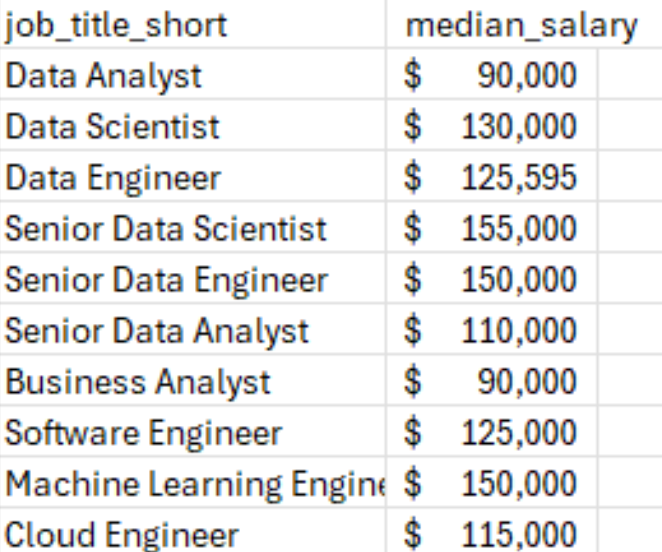
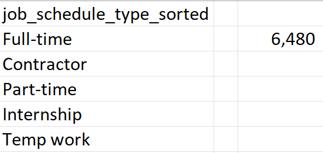

# Excel Salary Dashboard


## Introduction

This data jobs salary dashboard was created to help job seekers explore salary trends for their desired roles and better understand whether they are being fairly compensated.

The dataset, provided as part of my Excel course, contains detailed information on job titles, salaries, locations, and in-demand skills. I used this data to build an interactive dashboard that allows users to explore salary insights across different roles and locations.

### Dashboard File
You can check the dashboard here [Data_Jobs_Salary_Dashboard.xlsx](Data_Jobs_Salary_Dashboard.xlsx).

### Excel Skills Used

I used the following skills to analyze and build the dashboard

- **Charts**
- **Formulas & Functions**
- **Data Validation**

### Dataset

The dataset used in this project contains real-world data science job information from 2023. It was provided as part of my Excel course and served as the foundation for analyzing and visualizing salary trends using Excel. The dataset includes detailed information on:

- **Job titles**
- **Salaries**
- **Locations**
- **Skills**

### Dashboard Implementation

### Charts

#### Data Jobs Salaries - Bar Chart


- **Excel Features:** Used Excel’s bar chart feature with formatted salary values and a clean, organized layout.
- **Design Choice:** Chose a horizontal bar chart to make median salary comparisons easier to read.
- **Data Organization:** Sorted job titles by median salary in descending order for clearer comparison.
- **Insights Gained:** The chart highlights salary trends and shows that senior-level and engineering roles generally have higher median salaries than analyst roles.

#### Country Median Salaries - Map Chart


- **Excel Features:** Used Excel’s map chart feature to visualize median salaries across different countries.
- **Design Choice:** Applied color-coded regions to make differences in salary levels easier to identify.
- **Data Representation:** Displayed the median salary for each country with available data.
- **Visual Enhancement:** Made geographic salary patterns easier to interpret and compare at a glance.
- **Insights Gained:** Provides a clear overview of global salary differences and highlights regions with higher and lower median salaries.

### Formulas & Functions

#### Median Salary by Job Titles

```
=MEDIAN(
IF(
    (jobs[job_title_short]=A2)*
    (jobs[job_country]=country)*
    (ISNUMBER(SEARCH(type,jobs[job_schedule_type])))*
    (jobs[salary_year_avg]<>0),
    jobs[salary_year_avg]
)
)
```

- **Multi-Criteria Filtering:** Filters the data based on job title, country, schedule type, and excludes entries with missing salary values.
- **Array Formula:** Uses the MEDIAN() function with a nested IF() statement to evaluate multiple conditions across the dataset.
- **Data Representation:** Displayed the median salary for each country with available data.
- **Tailored Insights:** Provides targeted salary insights based on the selected job title, location, and schedule type.
- **Formula Purpose:** This formula populates the table below by calculating the median salary for the specified job title, country, and type.

Background Table




#### Implementation


#### Count of Job Schedule Type

```
=FILTER(J2#,(NOT(ISNUMBER(SEARCH("and",J2#))+ISNUMBER(SEARCH(",",J2#))))*(J2#<>0))
```

- **Unique List Generation:** Uses the FILTER() function to remove entries containing "and" or commas while excluding zero values.
- **Formula Purpose:** This formula populates the table below with a clean list of unique job schedule types.

Background Table



#### Implementation


### Data Validation

#### Filtered List

- **Enhanced Data Validation:** Applied the filtered lists as data validation rules for the `Job Title`, `Country`, and `Type` fields to ensure:
    - User input is limited to predefined and validated options
    - Incorrect or inconsistent entries are minimized
    - The overall usability and interactivity of the dashboard is improved


## Conclusion

I created this dashboard to explore salary trends across various data-related job roles. Using data provided through my Excel course, the dashboard allows users to analyze how factors such as job title, location, and employment type can influence salaries and support more informed career decisions.

